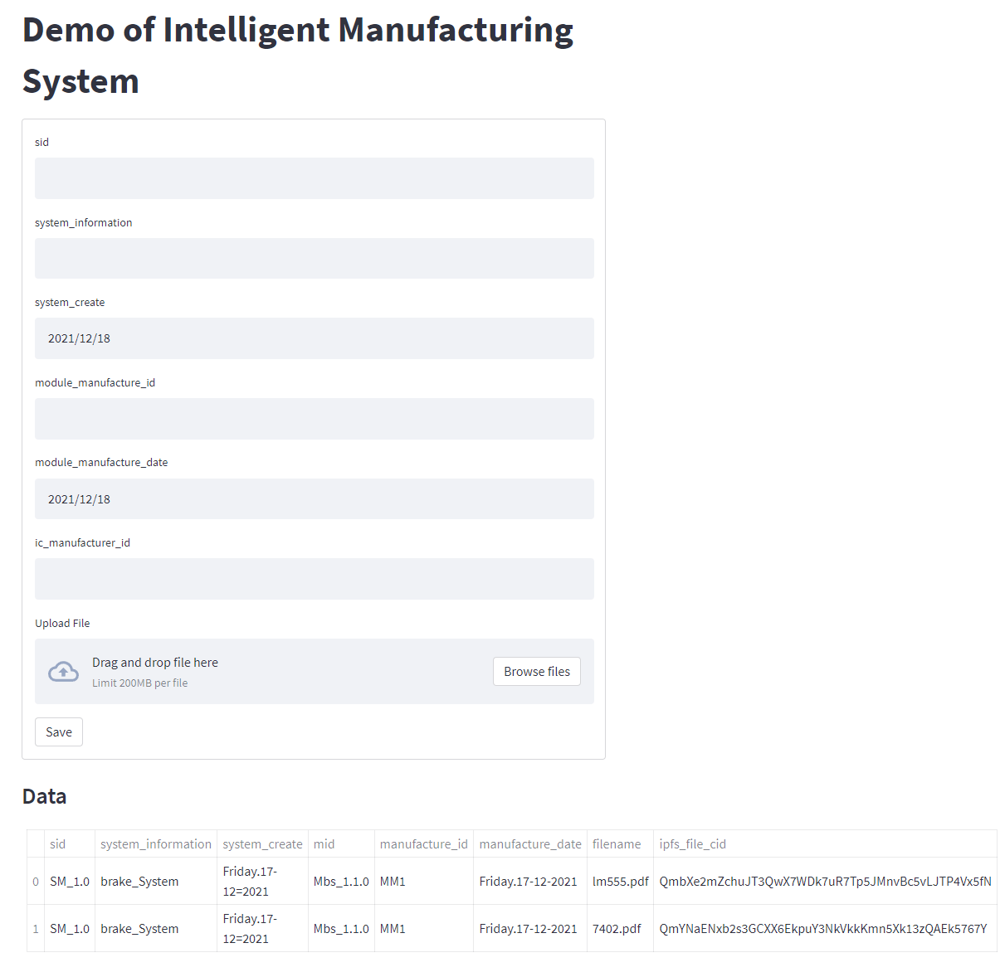

<!-- PROJECT LOGO -->
<p align="center">
  <h1 align="center">Aplikasi penyimpanan sederhana menggunakan Ethereum blockchan dan IPFS</h1>
  <p align="center">
    
  </p>
</p>

<!-- TABLE OF CONTENTS -->
<details open="open">
  <summary>Daftar Isi</summary>
  <ol>
    <li>
      <a href="#tentang-projek">Tentang Projek</a>
    </li>
    <li>
      <a href="#untuk-memulai">Untuk Memulai</a>
      <ul>
        <li><a href="#perangkat-lunak">Perangkat Lunak</a></li>
        <li><a href="#instalasi">Instalasi</a></li>
      </ul>
    </li>
    <li><a href="#penggunaan">Penggunaan</a></li>
    <li><a href="#kontak">Kontak</a></li>
    <li><a href="#acknowledgements">Acknowledgements</a></li>
  </ol>
</details>


<!-- ABOUT THE PROJECT -->
## Tentang Projek
Salah sat aplikasi sederhana untuk mendemonstrasikan alur pemrograman Ethereum blockcahin dan IPFS.
Aplikasi ini digunakan untuk menyimpan file di IPFS dan menyimpan catatannya di Ethereum blockchain



<!-- GETTING STARTED -->
## Untuk Memulai

Untuk dapat menjalankan Aplikasi ini pada komputer Anda, diperlukan beberapa perangkat lunak serta langkah instalasinya sebagai berikut:

### Perangkat Lunak

Pada saat pembuatan aplikasi ini, digunakan beberapa perangkat lunak dengan spesifikasi sebagai berikut:
- Nodejs versi v16.13.0
- Npm versi 8.1.0
- Truffle Framework versi v5.4.25
- Python web3 and streamlit package
- IPFS v0.11.0

## Menjalankan

1. Download / Clone kode aplikasi projek ini,
   ```sh
   git clone https://github.com/kangPrayit/eth_ipfs.git
   ```
2. Sebelum menjalankan aplikasi pastikan perangkat lunak yang dibutuhkan sudah terinstall semua.
3. Jalankan service ipfs
   ```shell
   ipfs init
   ipfs daemon
   ```
4. Jalankan service blockchain, kita dapat menggunakan truffle untuk simulasi blockcain network. Kemudian, migrasi smartcontract yang sudah dibuat.
   ```shell
   truffle develop
   truffle(develop)>migrate
   ```
5. Jalankan aplikasi menggunakan perintah:
   ```python
   streamlit run app.py
   ```
6. Jika berhasil Anda akan mendapatkan tampilan seperti berikut:


<!-- CONTACT -->
## Kontak

Prayitno - [@kang_prayit](https://twitter.com/kang_prayit)

Project Link: [https://github.com/kangPrayit/eth_ipfs](https://github.com/kangPrayit/eth_ipfs)
